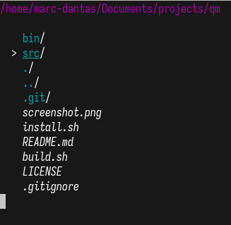

# qm
Quick Manager

A Simple file explorer written in C.



## Using qm

### Prerequesites
qm is written for **Linux systems**.

You only need [gcc](https://gcc.gnu.org/) to build the project.

### Building
Run the `build.sh` file in the root of the repository to build it:
```console
$ git clone https://github.com/marc-dantas/qm
$ cd qm
$ ./build.sh
```

### Installing
> **NOTE**: You need to build the project before installing qm.

Run the shell script named `install.sh` in the root of the repository:
```console
$ ./install.sh
```

Congratulations! qm is installed!

## Customization
I highly encourage you to take a look at the source code and modify it as you want.

At the top of the source code there are some configuration constants that you would like to
modify to your needs. 

## Tutorial
Use `[W]` and `[S]` to navigate up or down, respectively.

Use `[D]` to go into the folder currently selected.

Use `[A]` to go back (the same as going into `..` directory)

Press `[H]` to show Help message.

---

> By Marcio Dantas
